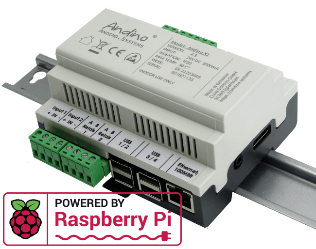
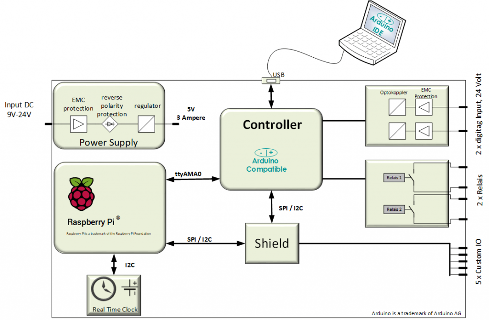
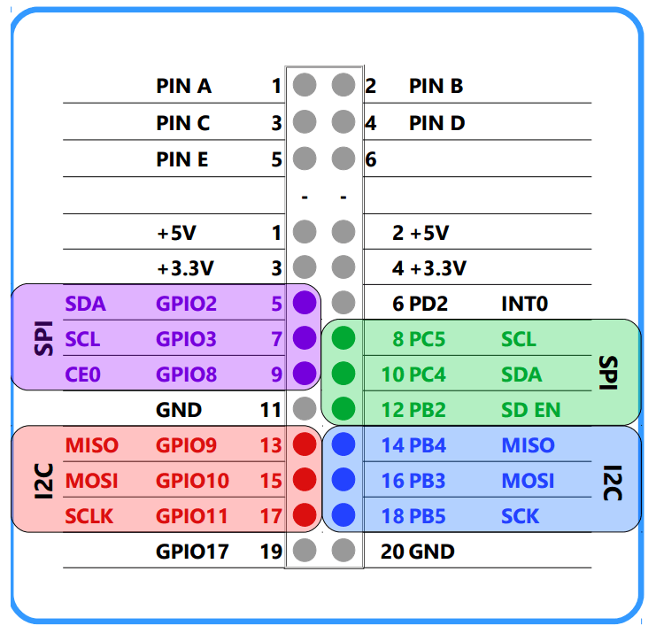
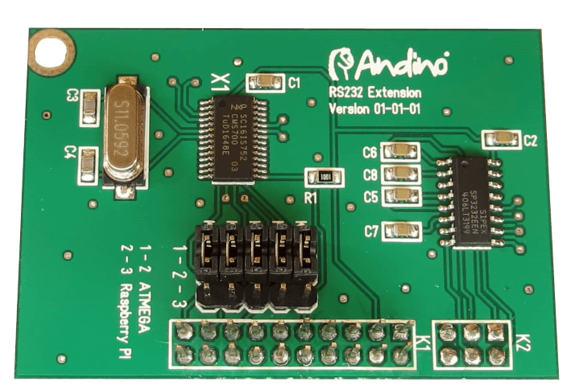
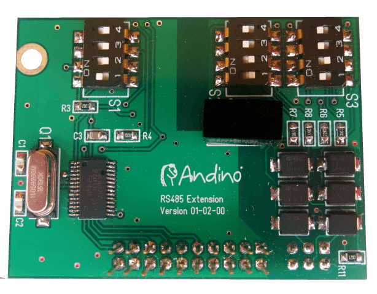
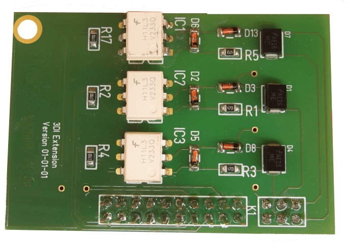
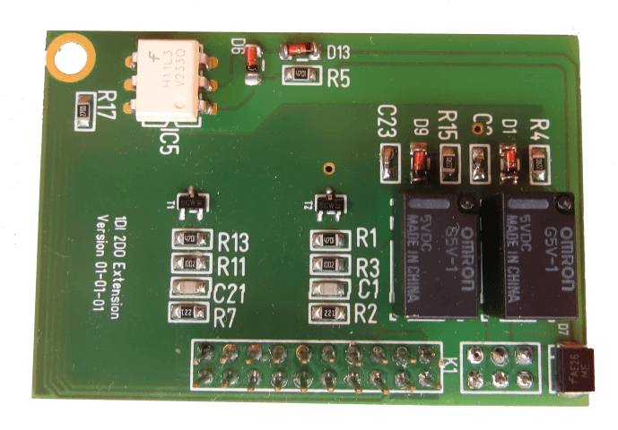
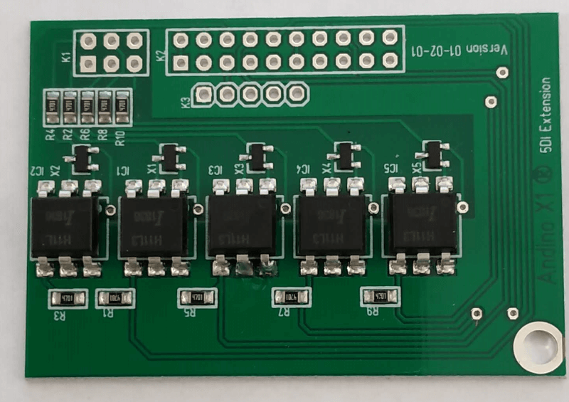

Andino X1
==========

[Andino X1][1], a base board that allows the raspberry pi to be used in an industrial environment on a DIN Rail.

**Please also look at our [Wiki](https://github.com/andino-systems/Andino-X1/wiki)**

  

  

**For more technical detailed documentation please see here:**

- [Andino X1 Base-Board: RTC and Arduino Firmware](https://github.com/andino-systems/doc/)
- [1 Input and 2 Relay Extension](https://github.com/andino-systems/Andino-X1/tree/master/doc/1DI2DO/)
- [5 Inputs Extension](https://github.com/andino-systems/Andino-X1/tree/master/doc/5DI/)
- [CAN Bus Extension](https://github.com/andino-systems/Andino-X1/tree/master/doc/CAN/)
- [Dual RS232 Extension](https://github.com/andino-systems/Andino-X1/tree/master/doc/RS232/)
- [RS485 / RS422 Extension](https://github.com/andino-systems/Andino-X1/tree/master/doc/RS485/)
- [Source of the default Arduino Firmware](https://github.com/andino-systems/Andino-X1/tree/master/src/firmware/counting)
- [Configure the Raspberry Pi to use the 4G Modem](https://github.com/andino-systems/Andino-IO/tree/master/qmi)

**New !**

Andino X1 with Serial Numbers from **201903xxx** has the ATMega328 instead the ATMega168 build in.
This means double Flash, EEProm and RAM !

[Please see here for more Details](https://github.com/andino-systems/Andino-X1/tree/master/doc/BaseBoard)

## Overview

The [Andino X1][1] is a microcontroller board for the Raspberry Pi in a DIN-rail housing for installation in a control cabinet. It is used to adapt digital inputs and outputs for a voltage of 24 V. The X1 has its own microcontroller for precise signal preprocessing and adaptation of signal generators and actuators. It also contains a Raspberry Pi (2/3). The inputs and outputs as well as the power supply of the Pi are optimally protected. Communication between the microcontroller and the Pi takes place via the UART interface.

The [Andino X1][1] offers the following advantages:

The sensitive GPIO of the Raspberry Pi are protected. Fast signals can be precisely detected by the microcontroller. Actuators and sensors can be electrically connected to the Raspberry Pi. It provides an industrial power supply for the Raspberry Pi. Customized adapters from the Raspberry Pi GPIO or the micro controller IO can be connected electrically to terminals. Provides mounting on a DIN rail for installation in manifolds.

#### Raspberry Pi compatible 
The 40-pin connector is compatible with Raspberry Pi 2 B and Raspberry Pi 3

#### Arduino compatible 
The Atmel microcontroller of the Andino X1 comes with an Arduino-compatible bootloader. The combination of Arduino and Raspberry Pi on the Andino X1 is ideally suited for use in home automation and sensor technology, as well as in more demanding industrial automation applications. The strengths of both boards complement each other perfectly. While the single-board computer Raspberry Pi can perform complex tasks (eg hosting of database and WebServer) as a full-value computer, the Arduino microcontroller can take care of the fast signal pre-processing. The Atmel Controller communicates via UART with the Pi. Programmable is the X1 with the Arduino IDE via USB from a PC or from a Raspberry (firmware update in the field).

#### Integrated power supply 
The X1 board has a 9-24V wide-range DC input with reverse polarity protection. Powerful, reliable, stable power supply: 5 Volt, 2.6 Amp – enough power for the Raspberry, your USB hardware and customer-specific adaptation. The integrated EMC protection circuits protect the Pi from voltage surges and current surges on the supply line.

#### 8 Bit Microcontroller 
Programmable 8-bit microcontroller (Atmega 168 8Mhz) for adapting the inputs and outputs. Accurate and reliable detection of digital and analog signals.

#### Galvanically isolated 
The X1 board has two electrically isolated inputs (up to 5kV isolated) as well as two relay outputs for 42 volts and 1 amp. The IO is controlled by a microcontroller. Further GPIO of the Raspberry Pi as well as IO of the Microcontroller are led on an internal pin header. This makes it possible to bring own adaptations to the screw terminals.

#### Expandable
Via the SPI and the I2C interface of the Raspberry Pi, further hardware extensions can be connected and led to the free screw terminals. Thus, a stable, control cabinet-compatible wiring is possible. Further Interfaces: RS485 / RS422 (2/4 lines) (planed for Q1/2017) M-Bus (Meter Bus) Analog Input (e.g. via Microchip MCP3008) Digital Input

#### Realtime Clock (RTC)
The integrated, battery-buffered RTC provides the correct time even if no NTP (time) server is available. The high-precision time chip DS3231 from Dallas Semiconductors is used. Due to the internal temperature compensation of the oscillator, the chip achieves a very high accuracy of ± 2ppm at 0 ° C to + 40 ° C.

## Block diagram

## Extendable
The SPI and I2C Busses of the Raspberry Pi and the Arduino Controller are connected with a Pin Header.
Different plugins can be plugged into this header.

Different extensions are available.

### Dualchannel RS232 Extension
Extends the Raspberry or the Arduino by two serial interfaces 

**See [here](https://github.com/andino-systems/Andino-X1/tree/master/doc/RS232) for more details.**

### RS485 / RS422 Extension
Extends the Raspberry or the Arduino by a fully isolated RS485 / RS422 interface

**See [here](https://github.com/andino-systems/Andino-X1/tree/master/doc/RS485) for more details.**

### 3 Digital Input
With this Extension the total count of Inputs is five. The Inputs are galvanically isolated to max 5kV.

**See [here](https://github.com/andino-systems/Andino-X1/tree/master/doc/3DI) for more details.**

### 1 Digital Input / 2 Relay Output
With this Extension the total count of Inputs is three and the total Relays are four. The Inputs are galvanically isolated to max 5kV.

**See [here](https://github.com/andino-systems/Andino-X1/tree/master/doc/1DI2DO) for more details.**

### 5 Digital Input
With this Extension the total count of Inputs is seven. The Inputs are galvanically isolated to max 5kV.

**See [here](https://github.com/andino-systems/Andino-X1/tree/master/doc/5DI) for more details.**

### Breadboard
For prototyping of a additional extension a Breadboard is also available.

### Application examples
* Data collection on production machines
* Collect and count Number of items, products
* Downtime detection
* Create Performance indicators Creation such as OEE, GAE and utilization
* Data collection at environmental monitoring stations
* Telecontrol and protocol converters
* Central in the house automation
* IoT nodes

### How to prepare the Raspbian
**[See here for more details.][3]**

### Programming examples

**[How to use Andino X1 with Node red](https://github.com/andino-systems/Andino-X1/tree/master/src/node-red-contrib-andinox1)**   
**[How to use Andino X1 with python](https://github.com/andino-systems/Andino-X1/tree/master/src/python)**   
**[Example Firmware](https://github.com/andino-systems/Andino-X1/tree/master/src/firmware/counting)**   

Author
-----

* 2017 by [AndinoSystems][2]
* [Contact us by email](mailto:info@andino.systems)

[1]:https://andino.systems/andino-x1/
[2]:https://github.com/andino-systems/Andino-X1
[3]:https://github.com/andino-systems/Andino-X1/tree/master/doc/BaseBoard

