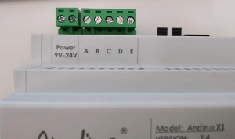

## 5 Digital Inputs
With this Extension the total count of Inputs are seven. The Inputs are galvanically isolated to max 5kV.
All five Inputs have a common ground.

### Connectors
Screw Terminal

Connection

Serial Interface

