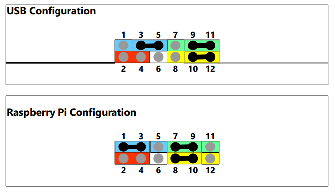
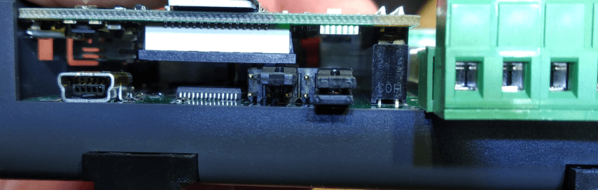

# Andino X1

Homepage of [Andino X1](https://andino.systems/andino-x1/)

Tabe of Content   
   
1. [How to enable the UART](README.md#how-to-enable-the-uart)
2. [Add the Driver for the RTC DS3231](README.md#add-the-driver-for-the-rtc-ds3231)
3. [Default Firmware on the Atmel](README.md#default-firmware-on-the-atmel)

------

## How to enable the UART

### 1. Enable UART as /dev/ttyAMA0 or /dev/serial0 

	sudo nano /boot/config.txt

add this at the end of the file..

	enable_uart=1
	dtoverlay=pi3-disable-bt-overlay 
	dtoverlay=pi3-miniuart-bt

### 2. Disable Console on /dev/serial0

	sudo nano /boot/cmdline.txt

Remove “console=… (cut between ~~)
  
	dwc_otg.lpm_enable=0 ~~console=serial0,115200 console=tty1~~ root=/dev/mmcblk0p2 rootfstype=ext4 .....

### 3. Reboot and test

	sudo apt-get install minicom
	sudo minicom --setup

Set Hardware Flow to No, set Device to /dev/ttyAMA0 or /dev/serial0, set BPS to 38400

	+-----------------------------------------------------------------------+
	| A - Serial Device : /dev/ttyAMA0                                      |
	| B - Lockfile Location : /var/lock                                     |
	| C - Callin Program :                                                  |
	| D - Callout Program :                                                 |
	| E - Bps/Par/Bits : 38400 8N1                                          |
	| F - Hardware Flow Control : No                                        |
	| G - Software Flow Control : No                                        |
	|                                                                       |
	| Change which setting?                                                 |
	+-----------------------------------------------------------------------+
	 | Screen and keyboard      |
	 | Save setup as dfl        |
	 | Save setup as..          |
	 | Exit                     |
	 | Exit from Minicom        |
	 +--------------------------+

## Add the Driver for the RTC DS3231

Enable I2C and add the Module the RTC DS3231

	sudo nano /boot/config.txt
uncomment dtparam=i2c_arm=on and add the dtoverlay=i2c-rtc,ds3231

	dtparam=i2c_arm=on
	#dtparam=i2s=on
	#dtparam=spi=on
	dtoverlay=i2c-rtc,ds3231

Execute this

	sudo -s
	chmod +x /etc/rc.local 
	apt-get install -y i2c-tools
	apt-get purge -y fake-hwclock 
	apt-get remove fake-hwclock -y 
	dpkg --purge fake-hwclock 
	rm -f /etc/adjtime. 
	cp /usr/share/zoneinfo/Europe/Berlin /etc/localtime
	ln -s /home/pi/bin/ntp2hwclock.sh /etc/cron.hourly/ntp2hwclock
	sudo reboot now

After reboot test this RTC

	pi@raspberrypi:~ $ i2cdetect -y 1

	     0  1  2  3  4  5  6  7  8  9  a  b  c  d  e  f
	00:          -- -- -- -- -- -- -- -- -- -- -- -- --
	10: -- -- -- -- -- -- -- -- -- -- -- -- -- -- -- --
	20: -- -- -- -- -- -- -- -- -- -- -- -- -- -- -- --
	30: -- -- -- -- -- -- -- -- -- -- -- -- -- -- -- --
	40: -- -- -- -- -- -- -- -- -- -- -- -- -- -- -- --
	50: -- -- -- -- -- -- -- -- -- -- -- -- -- -- -- --
	60: -- -- -- -- -- -- -- -- 68 -- -- -- -- -- -- --
	70: -- -- -- -- -- -- -- --
	pi@raspberrypi:~ $

	hwchwclock -w
	hwclock -r

This Python script sets the NTP Time to the HWClock as long a NTP connection can established.
Place this script at /home/pi/bin/ntp2hwclock.sh (for example, see above)

	#!/bin/bash
	# Location of logfile
	LOGFILE="/usr/local/oeebox/etc/log/ntp.log"
	if [ ! -f $LOGFILE ]; then
	  touch $LOGFILE
	fi
	# Set the maximum allowed difference in seconds between Hw-Clock and Sys-Clock
	maxDiffSec="2"
	msgNoConnection="No connection to time-server"
	msgConnection="Connection to time-server"
	# Check for NTP connection
	if ( ntpq -p | grep -q "^*"  ); then
	        echo $msgConnection >> $LOGFILE
	        echo "---------------------------------"  >> $LOGFILE
	        secHwClock=$(sudo hwclock --debug | grep "^Hw clock time" | awk '{print $(NF-3)}')
	        echo "HwClock: $secHwClock sec" >> $LOGFILE
	        secSysClock=$(date +"%s")
	        echo "SysClock: $secSysClock sec" >> $LOGFILE
	        echo "---------------------------------" >> $LOGFILE
	        secDiff=$(($secHwClock-$secSysClock))
	        # Compute absolute value
	        if ( echo $secDiff | grep -q "-" ); then
	            secDiff=$(echo $secDiff | cut -d "-" -f 2)
	        fi
	        echo "Difference: $secDiff sec" >> $LOGFILE
	        msgDiff="HwClock difference: $secDiff sec"
	        if [ "$secDiff" -gt "$maxDiffSec" ] ; then
	                echo "---------------------------------" >> $LOGFILE
	                echo "The difference between Hw- and Sys-Clock is more than $maxDiffSec sec." >> $LOGFILE
	                echo "Hw-Clock will be updated" >> $LOGFILE
	                # Update hwclock from system clock
	                sudo hwclock -w
	                msgDiff="$msgDiff --> HW-Clock updated." >> $LOGFILE
	        fi
	        if !(awk '/./{line=$0} END{print line}' $LOGFILE | grep -q "$msgConnection") || [ "$secDiff" -gt "$maxDiffSec" ]; then
	                echo $(date)": "$msgConnection". "$msgDiff >> $LOGFILE
	        fi
	else
	        # No NTP connection
	        echo $msgNoConnection
	        if !(awk '/./{line=$0} END{print line}' $LOGFILE | grep -q "$msgNoConnection"); then
	                echo $(date)": $msgNoConnection" >> $LOGFILE
	        fi
	fi

## Default Firmware on the Atmel

You will find the description and the INO-File of the default Firmware here:

[https://github.com/andino-systems/Andino-X1/tree/master/src/firmware/counting](https://github.com/andino-systems/Andino-X1/tree/master/src/firmware/counting)

The default UART Settings are 38400 / 8 / n / 1

## Programm your own Firmware

1. First install the Aruino IDE on your PC.
2. Set the Arduino IDE to the currect Board
2. Set the Jumper of the Andino to USB.
3. Programm the Firmware and test it.
4. Set the Jumper back to Raspberry Pi mode

To Install the IDE see [https://www.arduino.cc/en/Main/Software](https://www.arduino.cc/en/Main/Software?)

Set the Board to "Arduino Pro or Pro mini" and the CPU to ATMega168 (3.3Volt, 8MHz)  

Pin definition for In- and outputs:

	#define IN_1       7 // PD7  
	#define IN_1_PORT  PIND
	#define IN_1_PIN   7

	#define IN_2       6 // PD6
	#define IN_2_PORT  PIND
	#define IN_2_PIN   6

  	#define OUT_1     14 // PC0 analog 0  
	#define OUT_2     15 // PC1 analog 1  

	void setup() 
	{
		pinMode(IN_1,INPUT);   
		digitalWrite(IN_1, HIGH); // activate pull up resistor  	
		pinMode(IN_2,INPUT);   
		digitalWrite(IN_2, HIGH); // activate pull up resistor  
		pinMode(OUT_1,OUTPUT);  
		pinMode(OUT_2,OUTPUT);  
	}

		digitalWrite(OUT_1, 1);
		digitalWrite(OUT_1, 0);
		digitalWrite(OUT_2, 1);
		digitalWrite(OUT_2, 0);
		if( bitRead( IN_1_PORT, IN_1_PIN ) )
		{...
