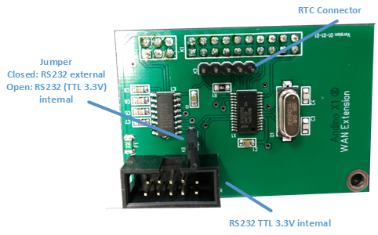

This is a tutorial to install quickly OpenHab (2) on the Raspberry Pi and add Z-Wave devices through a Z-Wave binding. If you intend to do something more computing-intensive with OpenHab, we reccommend to install it on your desktop or on a server.

## Prerequisites
We are going to install OpenHab through a docker image, because its the easiest way. We can do it because docker is also working on the RasPi (yiha!!!). 

* Prerequisites for docker: apt-transport-https ca-certificates software-properties-common
```bash
sudo apt-get install apt-transport-https ca-certificates software-properties-common -y
```
* Installing Docker with their install script:
```bash
curl -fsSL get.docker.com -o get-docker.sh && sh get-docker.sh
```
* Verification through the hello-world container:
```bash
$ sudo docker run hello-world

Hello from Docker!
This message shows that your installation appears to be working correctly.
#...
```
Another way is to just use the OpenHABian image, which is basically a raspbian image preconfigured with openhab. You can download it [here](https://www.openhab.org/docs/installation/openhabian.html). Then you need to copy it to a SD-Card (e.g. with [balenaEtcher](https://www.balena.io/etcher/)). Then you must configure the OS as stated in the [Andino X1 BaseBoard section](https://github.com/andino-systems/Andino-X1/wiki/Andino-X1-BaseBoard). 
## Running OpenHab
There are some more versions (beta, snapshots, etc.) of OpenHab. Here we are just using the version ``2.4.0``. For more information about OpenHab versions in docker, refer to the [OpenHab docker website](https://hub.docker.com/r/openhab/openhab/).
To run the OpenHab 2.4.0 version in docker just copy in a terminal:
```bash
docker run \
        --name openhab \
        --net=host \
        -v /etc/localtime:/etc/localtime:ro \
        -v /etc/timezone:/etc/timezone:ro \
        -v openhab_addons:/openhab/addons \
        -v openhab_conf:/openhab/conf \
        -v openhab_userdata:/openhab/userdata \
        -e "EXTRA_JAVA_OPTS=-Duser.timezone=Europe/Berlin" \
        -d \
        --restart=always \
        openhab/openhab:2.4.0
```
That was easy, wow! You can now continue to setup your OpenHab. If you don't know how, refer to their [first-time setup documentation](https://www.openhab.org/docs/tutorial/1sttimesetup.html).

If you want to install OpenHab without docker refer to the [OpenHub RasPi documentation](https://www.openhab.org/docs/installation/rasppi.html) or flash their preconfigured [openHABian image](https://www.openhab.org/docs/installation/openhabian.html) on the RasPi. An installation without docker can be faster than with.

## Bindings

### Z-Wave Binding
There are two bindings you can do: You can establish a binding the Z-Way server via an ip connection. You can also establish a binding directly with a Z-Wave interface device (like the RaZberry) via a serial connection. Unfortunately this is not yet possible to establish a connection this way.
##### 1. Z-Way Binding
Actually this is straight forward if you know about openhab. Go in to the paper UI of the openhab. 
1. Install the the Z-Way Binding when you search in ``Add-ons`` -> ``Bindings`` for Z-Way and click on ``Install``.
2. After it finished installing, you can add the server as a thing: Go To ``Inbox``, click on the ``+``-circle and add the Z-Way Server as a thing. 
<div style="text-align:center;"></div>
3. Now goto ``Configuration``->``Things`` and edit the Z-Way Server. 
4. Here you can configure the connection to the Z-WAy server. Configure the parameters as you need to or let it at the default values. Finally type in the password you set for the Z-Way access.
5. Great! The server should be now online. After a few moments, your devices should be in the inbox and you can add them as a thing.


