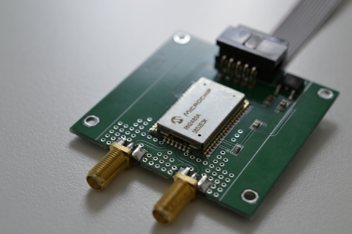
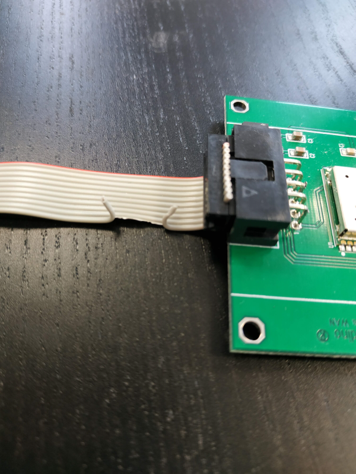

# Connecting Lora WAN to the Raspberry Pi with Andino X1

The Lora Modem is connected via the internal RS232 Connector to the /dev/ttySC1.

The Serial Setup is (e.g. with minicom)

    +-----------------------------------------+
    | A -Serial Device  : /dev/ttySC1         |
    | B - Lockfile Location : /var/lock       |
    | C -   Callin Program  :                 |
    | D -  Callout Program  :                 |
    | E -Bps/Par/Bits   : 57600 8N1           |
    | F - Hardware Flow Control : No          |
    | G - Software Flow Control : No          |
    |                                         |
    |Change which setting?                    |
    +-----------------------------------------+
    | Screen and keyboard      |
    | Save setup as dfl        |
    | Save setup as..          |
    | Exit                     |
    | Exit from Minicom        |
    +--------------------------+
    

The Reset of the Modem can be controlled via the RTS Line. By default this line is cut the that the Modem runs on Power On. If you like to controll the Reset via RTS you need to replace the cable.

 

## Example 

    pi@raspberrypi:~ $ python get-deveui.py
    sys reset
    RN2483 1.0.4 Oct 12 2017 14:59:25
    mac get deveui
    0004A30B002544A2
    