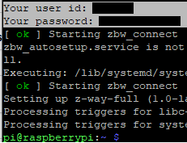
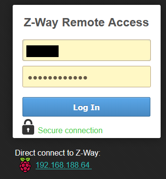

This guide describes the installation of the RaZberry module on the Raspberry Pi with the RS232-WAN extension shield as an internal connection. 

## Prerequisites
Like the [LoRaWAN Extension](https://github.com/andino-systems/Andino-X1/tree/master/doc/RS232_LoraWAN_2G_4G) this extension has the same connection shield. So on a freshly installed Rasbian you should [install the SCI16IS752 overlay](https://github.com/andino-systems/Andino-X1/wiki/Install-SC16IS752-overlay).

## Installation of the Z-Way server
To install the Z-Way server just type in the terminal.
```bash
$ wget -q -O - https://storage.z-wave.me/RaspbianInstall | sudo bash
```
**Make sure to not close the terminal.** In the console log is an user id and password that you will need for the server access. If you've closed it accidentally, you can find the credentials also in `/etc/zbw`.

#### Verify installation
To verify your installation go to [find.z-wave.me](https://find.z-wave.me) and type in the user id and password from the console log. 
The password for the admin user can now be set. The dashboard can be then accessed via remote or locally. For a remote access on [find.z-wave.me](https://find.z-wave.me) use __&lt;user id>/admin__ (and of course the already set admin password). If access it locally (i.e. on _&lt;ip_of_raspi>:8083/smarthome_) just use __admin__ and the set password.
<center></center>

#### Configure serial port
Before you start to add your device, you need to change the serial port and to establish a connection to the shield:
1. Click on settings button on the up right corner and click on ``Apps``
2. Click on ``Z-Wave Network Access``
3. Change _Serial port to Z-Wave dongle_ to ``/dev/ttySC1`` and save. If there is a binding error you can firstly try to change the port to ``/dev/ttySC0``.

 If there is still a binding error an update of the kernel with ``sudo rpi-update`` followed by ``sudo reboot`` could help.

__What if the ID is not recognized or in general the login not working?__
It could occur that the server do not start after a reboot. The server can be then started again with the following command: 
```bash
$ sudo apt-get --reinstall install -o Dpkg::Options::="--force-confmiss" -o Dpkg::Options::="--force-confold" -y z-way-server
```

## Device Configuration
For this guide we use an [Abus wireless socket](https://www.abus.com/eng/content/view/full/59246) to demonstrate how to add a device to the server. 
1. Plug in the wireless socket in a socket. The status LED should flash periodicly
2. Click on the settings menu in up right corner and choose "Devices".
3. Select Z-Wave device type and click on "Add new"
4. Now click on "Start". Reseting the device is not necessary when you have not already added it or it is on factory default.
5. Now press one time on the power button on the device. The device should automatically configure.

Now you should see in the Elements tab some electric metering cards and (if something is plugged in the device) changing values.
